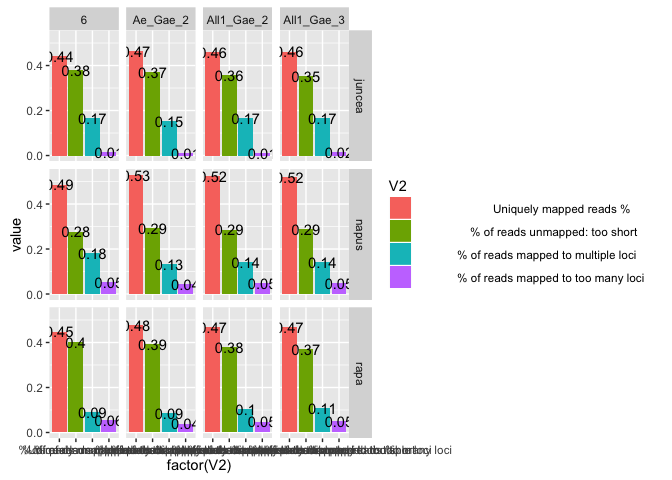
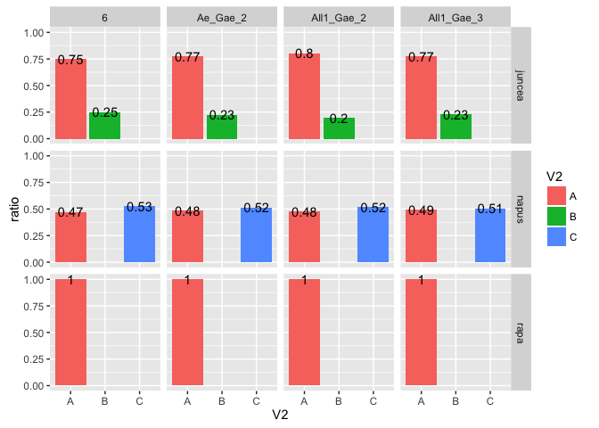

# mapping_compare_napus_rapa_juncea
Ruijuan Li  
11/30/2016  

# compare mapping result to napus, rapa, and juncea for Da-Ae & Da-Ol-1 

```r
library(ggplot2)
# 1) get material, flowering stage sample for Da-Ae & Da-Ol-1 
# done

# 2) index reference rapa & juncea genome 
# rapa genome 
# juncea genome 

# 3) map 

# 4) check & compare result  
#### total mapping summary  
total_mapping <- read.csv("~/Desktop/Brassica_project/KIAT_RNA_seq/mapping_napus_rapa_juncea/mapping_summary.csv", header = F)
head(total_mapping)
total_mapping$value <- as.numeric(gsub("%", "", total_mapping$V3, fixed=T))/100
total_mapping$ref <- gsub("([[:print:]]+)(rapa|napus|juncea)", "\\2", total_mapping$V1)
total_mapping$lib <- gsub("([[:print:]]+)(_)(paired.star.dir.rapa|paired.star.dir.napus|paired.star.dir.juncea)", "\\1", total_mapping$V1)
total_mapping$gt <- c(rep("Da-Ae",24), rep("Da-Ol-1", 24))
total_mapping$lib

p.total_mapping <- ggplot(data = total_mapping) + theme_grey()
p.total_mapping <- p.total_mapping + geom_bar(aes(x=factor(V2), y = value, fill=V2), stat="identity")
p.total_mapping <- p.total_mapping + facet_grid(ref~lib)
p.total_mapping <- p.total_mapping + geom_text(data = total_mapping, aes(x=factor(V2), y=value, label=factor(value)))
# geom_text(data=DEGs_number_between_gt.melt.parent,aes(x=DE,y=number*1.05,label=factor(number)))
p.total_mapping 
```



```r
ggsave(p.total_mapping, filename = "~/Desktop/Brassica_project/KIAT_RNA_seq/mapping_napus_rapa_juncea/p.total_mapping.png", width = 12, height=8)

### conlussions: no difference between Da-Ae and Da-Ol-1's mapping ratio to different ref genomes. napus has the highest mapping ratio among the 3 ref genomes, followed by juncea and rapa.  

#### subgenome mapping summary (only unique mapped reads)
subgenome_mapping <- read.csv("~/Desktop/Brassica_project/KIAT_RNA_seq/mapping_napus_rapa_juncea/subgenome_mapping_summary.csv", header = F)
head(subgenome_mapping, 20)
subgenome_mapping <- subgenome_mapping[grep("^A$|^B$|^C$", subgenome_mapping$V2),]
unique_mapping_sum <- aggregate(subgenome_mapping$V1, list(subgenome_mapping$V3), sum)
names(unique_mapping_sum) <- c("V3", "total")
head(unique_mapping_sum)
subgenome_mapping.2 <- merge(subgenome_mapping, unique_mapping_sum, by="V3")
subgenome_mapping.2$ratio <- subgenome_mapping.2$V1/subgenome_mapping.2$total

subgenome_mapping.2$ref <- gsub("([[:print:]]+)(_paired.star.dir.)(napus|rapa|juncea)([[:punct:]]+)(subgenome_mapping_summary_main)", "\\3", subgenome_mapping.2$V3)
subgenome_mapping.2$lib <- gsub("([[:print:]]+)(_paired.star.dir.)(napus|rapa|juncea)([[:punct:]]+)(subgenome_mapping_summary_main)", "\\1", subgenome_mapping.2$V3)
subgenome_mapping.2$gt <- c(rep("Da-Ae", 10), rep("Da-Ol-1", 10))

subgenome_mapping.2$lib
subgenome_mapping.2$ratio
subgenome_mapping.2$V2 

p.subgenome_mapping <- ggplot(data = subgenome_mapping.2)
p.subgenome_mapping <- p.subgenome_mapping + geom_bar(aes(x=V2, y = ratio, fill=V2), stat="identity")
p.subgenome_mapping <- p.subgenome_mapping + facet_grid(ref~lib)
p.subgenome_mapping <- p.subgenome_mapping + geom_text(data = subgenome_mapping.2, aes(x=factor(V2), y=ratio, label=factor(round(ratio, digits = 2))))
# geom_text(data=DEGs_number_between_gt.melt.parent,aes(x=DE,y=number*1.05,label=factor(number)))
p.subgenome_mapping 
```



```r
ggsave(p.subgenome_mapping, filename = "~/Desktop/Brassica_project/KIAT_RNA_seq/mapping_napus_rapa_juncea/p.subgenome_mapping.png", width = 12, height=8)

### conlussion: the lowest but good partion of reads mapped to B subgenome, and the percentage is about the same between Da-Ae & Da_Ol-1. This suggest that that the genetic makeup between Da-Ae & Da-Ol-1 is not that different... 

#### reads level mapping detail check ... 
reads_mapping <- read.csv("~/Desktop/Brassica_project/KIAT_RNA_seq/mapping_napus_rapa_juncea/reads_mapping_summary.csv", header = F)
head(reads_mapping)
reads_mapping <- reads_mapping[grep("^A$|^C$|^non_unique$|^unmapped$", reads_mapping$V2),]
reads_mapping_sum <- aggregate(reads_mapping$V1, list(reads_mapping$V3), sum)
names(reads_mapping_sum) <- c("V3", "total")
head(reads_mapping_sum)
reads_mapping.2 <- merge(reads_mapping, reads_mapping_sum, by="V3")
reads_mapping.2$ratio <- reads_mapping.2$V1/reads_mapping.2$total

reads_mapping.2

reads_mapping.2$ref <- gsub("([[:print:]]+)(juncea|rapa)(_)(6_Da-Ae_Asub.summary|6_Da-Ae_Csub.summary|All1_Gae_Da-Ol_Asub.summary|All1_Gae_Da-Ol_Csub.summary|6_Ae_summary|All1_Gae_Ol_summary)", "\\2", reads_mapping.2$V3)
reads_mapping.2$sub <- c(rep("A", 4), rep("B", 4), rep("A", 3), rep("B", 3), rep("A", 7))
reads_mapping.2$gt <- c(rep("Da-Ae", 8), rep("Da-Ol-1", 6), rep("Da-Ae", 4), rep("Da-Ol-1", 3))
reads_mapping.2$group <- paste(reads_mapping.2$ref, reads_mapping.2$sub, sep = "_")

p.reads_mapping <- ggplot(data = reads_mapping.2)
p.reads_mapping <- p.reads_mapping + geom_bar(aes(x=V2, y = ratio, fill=V2), stat="identity")
p.reads_mapping <- p.reads_mapping + facet_grid(group~gt)
p.reads_mapping <- p.reads_mapping + geom_text(data = reads_mapping.2, aes(x=factor(V2), y=ratio, label=factor(round(ratio, digits = 2))))
# geom_text(data=DEGs_number_between_gt.melt.parent,aes(x=DE,y=number*1.05,label=factor(number)))
p.reads_mapping 
```


```r
ggsave(p.reads_mapping, filename = "~/Desktop/Brassica_project/KIAT_RNA_seq/mapping_napus_rapa_juncea/p.reads_mapping.png", width = 12, height=8)

### conclussion: by looking at the composition of reads mapped to rapa & juncea (where do they map to the napus genome), relatively bigger difference was observed for the juncea B subgenome mapped reads, some of Da-Ol-1 C subgenome reads were from juncea's B subgenome?    
```

